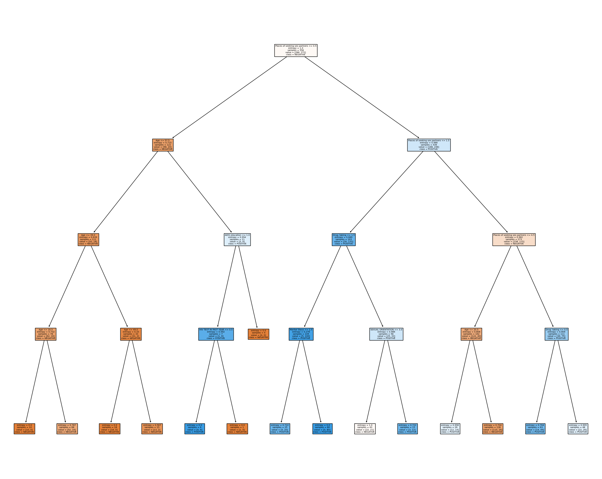
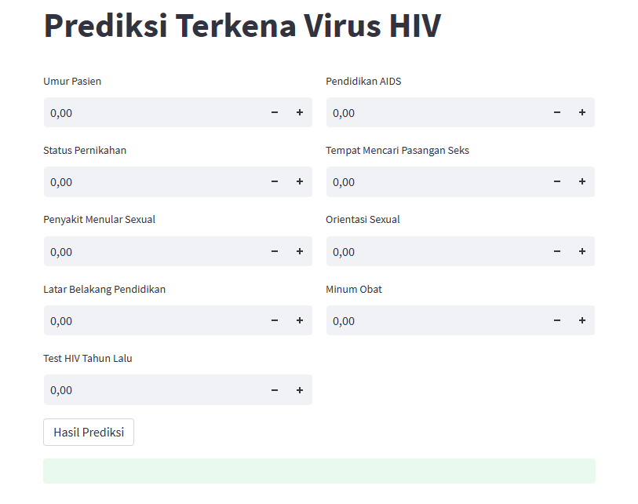

# Laporan Proyek Machine Learning
### Nama : Devi Indah Sari 
### Nim : 21135104
### Kelas : Pagi B

## Domain Proyek
Proyek ini bertujuan untuk melakukan prediksi dan analisis terkait HIV Prediction. Data yang digunakan mencakup informasi tentang pasien, termasuk riwayat medis, faktor-faktor risiko, dan hasil tes terkait dengan HIV. Tujuan dari proyek ini adalah untuk mengembangkan model prediksi yang dapat membantu dalam menentukan risiko terjangkitnya HIV pada pasien. Analisis ini bertujuan untuk memahami faktor-faktor yang berkontribusi terhadap risiko HIV, serta memprediksi kemungkinan terjangkitnya HIV berdasarkan data pasien. Hasil dari proyek ini dapat membantu dalam upaya pencegahan dan pengelolaan HIV, serta meningkatkan pemahaman tentang faktor-faktor risiko yang berkaitan dengan penyebaran virus HIV.

## Business Understanding
Pada tahap ini, kita perlu memahami aspek-aspek penting terkait prediksi HIV, termasuk faktor-faktor risiko yang memengaruhi penularan penyakit ini, serta tanda-tanda atau hasil tes yang dapat digunakan untuk memprediksi kemungkinan terjangkitnya HIV pada individu. Selain itu, penting untuk memahami bagaimana data medis dan informasi yang relevan dengan pasien dapat dimanfaatkan untuk mengembangkan model prediksi yang akurat. Proyek ini bertujuan untuk mengembangkan model prediksi yang dapat membantu dalam upaya pencegahan dan pengelolaan HIV, dengan fokus pada diagnosis dini dan penentuan risiko individu terjangkit HIV.

### Problem Statements
- Mengembangkan model prediksi yang mampu memprediksi risiko terjangkitnya HIV pada individu berdasarkan data medis dan faktor-faktor risiko yang relevan, dengan tujuan untuk identifikasi awal risiko individu dan pencegahan penularan HIV yang lebih efektif.    

 ### Goals
 - Tujuan dari proyek ini adalah untuk mengembangkan model prediksi yang sangat tepat dalam menilai risiko individu terjangkit HIV berdasarkan data medis dan faktor-faktor risiko yang signifikan. Model ini akan digunakan untuk melakukan identifikasi dini risiko individu terjangkit HIV, memberikan panduan bagi tindakan pencegahan yang lebih tepat sasaran, dan meningkatkan pemahaman tentang faktor-faktor risiko yang memengaruhi penyebaran virus HIV.

  ### Solution statements
Pengembangan model prediksi yang menggabungkan data medis dan faktor-faktor risiko individu untuk memprediksi risiko terjangkitnya HIV. Model ini akan memanfaatkan algoritma machine learning dan data pasien untuk memberikan hasil prediksi yang andal. Solusi ini ditujukan untuk menyediakan sarana yang dapat digunakan untuk mendukung identifikasi awal risiko individu terjangkit HIV, memungkinkan tindakan pencegahan yang lebih efektif, serta berkontribusi pada pemahaman yang lebih baik tentang cara mengendalikan penyebaran virus HIV.

  ## Data Understanding
  Tahap ini memberikan dasar analitik untuk proyek penelitian dengan melakukan rangkuman dan identifikasi potensi masalah dalam data yang diperoleh untuk HIV Prediction.  

  https://www.kaggle.com/datasets/ishigamisenku10/hiv-prediction

  ### Variabel-variabel pada Europe bike store sales adalah sebagai berikut:
 1. Age = int64 
 2. Marital Staus = object
 3. STD = object
 4. Educational Background = object
 5. HIV TEST IN PAST YEAR = object
 6. AIDS education = object
 7. Places of seeking sex partners = object
 8. SEXUAL ORIENTATION =  object
 9. Drug- taking =  object
 10. Result = object
 
## Data Preparation
### Data Collection

Data yang dikumpulkan adalah kumpulan informasi medis yang berharga yang mencakup riwayat penyakit, faktor-faktor risiko, dan hasil tes terkait dengan HIV. Data ini diperoleh melalui berbagai lembaga medis dan rumah sakit yang memiliki catatan medis pasien. Data ini memainkan peran kunci dalam upaya identifikasi dini dan pemahaman lebih lanjut tentang faktor-faktor yang memengaruhi penyebaran dan risiko terjangkitnya virus HIV.

### Data Discovery And Profiling
Pertama kita harus mengimport library yang dibutuhkan 
``` bash
import pandas as pd
import numpy as np
```
disini kita akan memasukan dataset dan melihat data sample
```bash
df = pd.read_csv('HIV_dataset.csv')
df.sample()
```
selanjutnya melihat type data yang digunakan
``` bash
df.info()
```
lKode program ini digunakan untuk mengelompokkan kolom dalam sebuah DataFrame (diasumsikan sebagai df) menjadi dua jenis, yaitu kolom numerik dan kolom kategori, lalu mengisi nilai yang hilang (NaN) dalam kolom-kolom tersebut
``` bash
numerical = []
catgcols = []

for col in df.columns:
if df[col].dtype=="int64":
numerical.append(col)
else:
catgcols.append(col)

for col in df.columns:
if col in numerical:
df[col].fillna(df[col].median(), inplace=True)
else:
df[col].fillna(df[col].mode()[0], inplace=True)
```
``` bash
numerical
```
``` bash
catgols
```
disini kita akan menghitung berapa kali masing-masing nilai unik dalam kolom 'Result' dari DataFrame 'df'
``` bash
df['Result'].value_counts()
```
selanjutnya menggantikan nilai "Positive" dengan "POSITIVE" dalam kolom 'Result' dari sebuah DataFrame (diasumsikan menggunakan library seperti pandas dalam Python) dan kemudian menghitung jumlah kemunculan setiap nilai dalam kolom 'Result' yang sudah diubah.

``` bash
df['Result'] =df['Result'].replace(['Positive'],'POSITIVE')
```
``` bash
df['Result'].value_counts()
```
lalu mengganti nilai "Negative" dalam kolom 'Result' DataFrame 'df' dengan nilai "NEGATIVE", dan kemudian menghitung jumlah kemunculan setiap nilai dalam kolom 'Result' yang sudah diubah
``` bash
df['Result'] =df['Result'].replace(['Negative'],'NEGATIVE')
```
``` bash
df['Result'].value_counts()
```
kita akan menghitung jumlah kemunculan setiap nilai dalam kolom 'Result' dari sebuah DataFrame
``` bash
ind_col = [col for col in df.columns if col != 'Result']
dep_col = 'Result'
```
``` bash
df[dep_col].value_counts()
```

lalu mengubah nilai-nilai kategorikal menjadi angka, sehingga data dapat digunakan dalam model-machine learning yang memerlukan input numerik
``` bash
from sklearn.preprocessing import LabelEncoder
le = LabelEncoder()

for col in catgcols:
df[col] =le.fit_transform(df[col])
```

``` bash
df['Result'] = le.fit_transform(df['Result'])
```

``` bash
x = df[ind_col] #feature
y = df[dep_col] #label
```
lalu menampilkan 5 df setelah proses encoding selesai
``` bash
df.head()
```

## Modeling
Selanjutnya kita akan membuat Model Decision Tree dan melihat akurasi data training dan testing, Matriks konfusi dicetak menggunakan confusion_matrix, dan elemen-elemen matriks konfusi seperti True Negative , False Positive, False Negative, dan True Positive  dihitung dan dicetak. classification_report yang memberikan informasi tentang presisi, recall, F1-score, dan lain-lain untuk setiap kelas yang ada dalam data pengujian.

``` bash
from sklearn.metrics import accuracy_score, confusion_matrix, classification_report
from sklearn.tree import DecisionTreeClassifier
from sklearn import tree

dtc = DecisionTreeClassifier(
    ccp_alpha=0.0, class_weight=None, criterion='entropy',
    max_depth=4, max_features=None, max_leaf_nodes=None,
    min_impurity_decrease=0.0, min_samples_leaf=1,
    min_samples_split=2, min_weight_fraction_leaf=0.0,
    random_state=42, splitter='best'
)

model = dtc.fit(x_train, y_train)
dtc_acc = accuracy_score(y_test, dtc.predict(x_test))

print(f"akurasi data training = {accuracy_score(y_train, dtc.predict(x_train))}")
print(f"akurasi data testing = {dtc_acc} \n")

print(f"confusion matrix : \n{confusion_matrix(y_test, dtc.predict(x_test))}\n")
confusion = confusion_matrix(y_test, dtc.predict(x_test))
tn, fp, fn, tp = confusion.ravel()
print(f"classification report : \n {classification_report(y_test, dtc.predict(x_test))}")
```
akurasi data training = 0.7831541218637993
akurasi data testing = 0.75 

## Evaluasi
disini kita akan melakukan prediksi apakah seorang pasien terkena HIV atau tidak.
``` bash
input_data = (22,5,0,0,1,0,0,2,2)

input_data_as_numpy_array = np.array(input_data)

input_data_reshape = input_data_as_numpy_array.reshape(1, -1)

prediction = model.predict(input_data_reshape)
print(prediction)

if (prediction[0]==1):
print ('Pasien tidak terkena HIV')
else:
print ('Pasien terkena HIV')
```
disini kita akan membuat visualisasi pohon keputusan (decision tree). Visualisasi digunakan untuk memahami bagaimana model pohon keputusan membuat prediksi dengan membagi data berdasarkan serangkaian aturan.
``` bash
import matplotlib.pyplot as plt
fig = plt.figure(figsize=(25,20))
_ = tree.plot_tree(model,
feature_names=ind_col,
class_names=['NEGATIVE','POSITIVE'],
filled=True
)
```
 <br>

## Deployment

  [App](https://pembelajaranmesin-cfkaxpm9dt4bhbuxqysnij.streamlit.app/)

  
